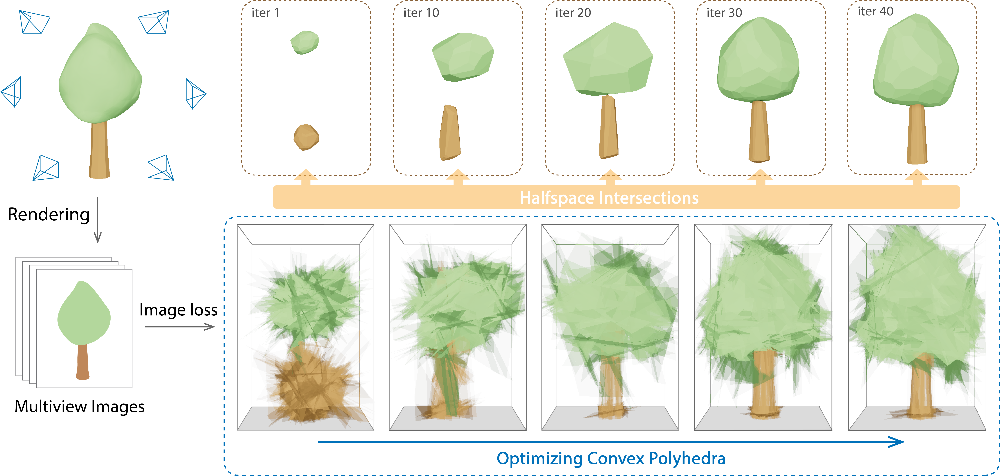

# Differentiable Convex Polyhedra Optimization from Multi-view Images

This is the code for the paper "Differentiable Convex Polyhedra Optimization from Multi-view Images" 
(This repo is still under construction. Please check back later for updates.)
## Install dependencies for building
```
sudo apt-get install -y git
sudo apt-get install -y cmake
sudo apt-get install -y ninja-build
sudo apt-get install -y build-essential
sudo apt-get install -y libcgal-dev
sudo apt-get install -y libtbb-dev
```
## install python packages
```
pip install torch torchvision torchaudio
git clone https://github.com/NVlabs/nvdiffrast
cd nvdiffrast
pip install .
pip install imageio
pip install trimesh
pip install pandas
pip install scipy
pip install "git+https://github.com/facebookresearch/pytorch3d.git"
pip install ./diff_convex # install this package
```
## Run example
```
python reconstruct_mesh.py --mesh scenes/meshes/bunny.ply
```
## Notes on running with your own data
1. Make sure your mesh is the same scale as the bunny mesh.
2. Make sure your mesh does not have flip normals
3. Only PLY file is supported
After that, you can run the code with your own mesh.
```
python reconstruct_mesh.py --mesh path_to_your_mesh.ply
```
## Disclaimer
The code in scripts and the scenes are copy from the [large-steps-pytorch](https://github.com/rgl-epfl/large-steps-pytorch) repository. Please consider citing their work if you use this code.